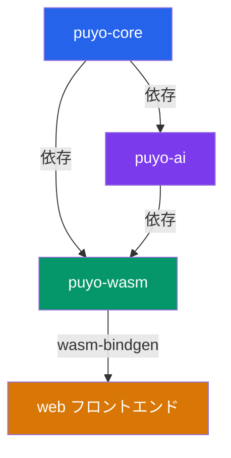

# 仕様書 目次・用語集・依存関係図

| 項目 | 値 |
|------|-----|
| ステータス | 実装済み |
| クレート | 全体 |
| 最終更新 | 2026-02-13 |
| 対応ソース | — |

## プロジェクト概要

Puyo Puyo AI は、ぷよぷよの盤面シミュレーション・連鎖エンジン・AI探索・Webフロントエンドを統合したフルスタックゲームプロジェクトである。

### 技術スタック

| レイヤー | 技術 | 説明 |
|----------|------|------|
| コアロジック | Rust (puyo-core) | 盤面・ぷよ組・連鎖・スコア・ゲーム進行・乱数 |
| AI エンジン | Rust (puyo-ai) | 評価関数・探索・配置列挙 |
| WASM ブリッジ | Rust (puyo-wasm) + wasm-bindgen | Rust ↔ JS の橋渡し |
| フロントエンド | TypeScript + Vite | Canvas 描画・入力・UI・ゲームループ |

### 目的

- 決定論的なぷよぷよエンジンを Rust で実装し、WASM 経由でブラウザ上で動作させる
- 探索ベースの AI を搭載し、手動プレイとAIプレイを切り替え可能にする
- 仕様駆動開発により、未実装機能の設計を先行して文書化する

## 仕様書一覧

| ファイル | 概要 | ステータス |
|----------|------|-----------|
| [00-index.md](./00-index.md) | 目次・用語集・依存関係図 | 実装済み |
| [01-architecture.md](./01-architecture.md) | システムアーキテクチャ | 実装済み |
| [02-board.md](./02-board.md) | 盤面仕様 | 実装済み |
| [03-piece.md](./03-piece.md) | ぷよ組・ツモ仕様 | 実装済み |
| [04-chain.md](./04-chain.md) | 連鎖処理仕様 | 実装済み |
| [05-score.md](./05-score.md) | スコア計算仕様 | 実装済み |
| [06-game.md](./06-game.md) | ゲーム進行・状態管理仕様 | 実装済み |
| [07-rng.md](./07-rng.md) | 乱数生成仕様 | 実装済み |
| [08-ai-eval.md](./08-ai-eval.md) | AI 評価関数仕様 | 実装済み |
| [09-ai-search.md](./09-ai-search.md) | AI 探索アルゴリズム仕様 | 実装済み |
| [10-wasm-bridge.md](./10-wasm-bridge.md) | WASM ブリッジ API 仕様 | 実装済み |
| [11-frontend.md](./11-frontend.md) | フロントエンド仕様 | 実装済み |
| [12-multiplayer.md](./12-multiplayer.md) | 対戦・おじゃまぷよ仕様 | 未実装 |
| [13-ai-advanced.md](./13-ai-advanced.md) | 高度 AI 探索仕様 | 未実装 |
| [14-replay.md](./14-replay.md) | リプレイシステム仕様 | 未実装 |
| [15-config-ui.md](./15-config-ui.md) | 設定 UI 仕様 | 未実装 |
| [16-sound-animation.md](./16-sound-animation.md) | サウンド・アニメーション仕様 | 未実装 |

## 用語定義

| 用語 | 定義 |
|------|------|
| 軸ぷよ (axis) | ぷよ組の回転中心となるぷよ。操作時の基準位置 |
| 衛星ぷよ (satellite) | 軸ぷよの周りを回転するぷよ |
| ツモ (tsumo) | 落下してくるぷよ組。軸ぷよと衛星ぷよの2個1組 |
| 連鎖 (chain) | 同色ぷよ4個以上の連結が消去され、落下した結果さらに消去が発生する連続反応 |
| おじゃまぷよ (nuisance) | 対戦時に相手に送られるぷよ。連結しても消えないが、隣接する色ぷよの消去に巻き込まれて消える（未実装） |
| 致死行 (death row) | 3列目（列インデックス2）の VISIBLE_ROWS（行12）を超える位置。ここにぷよが到達するとゲームオーバー |
| ウォールキック (wall kick) | 壁際での回転時に、自動的に反対方向に1マスシフトして回転を成立させる補正 |
| 接地 (landing) | 落下中のぷよ組が盤面上のぷよまたは底面に到達し、配置が確定すること |
| ゴースト (ghost) | 現在のぷよ組をハードドロップした場合の着地位置を示す半透明の表示 |
| BFS flood-fill | 幅優先探索による塗りつぶしアルゴリズム。連結グループの検出に使用 |

## クレート依存関係図

### 依存の方向

- `puyo-core`: 外部依存なし。盤面・ぷよ組・連鎖・スコア・ゲーム・乱数の基盤
- `puyo-ai`: `puyo-core` に依存。評価関数と探索アルゴリズムを提供
- `puyo-wasm`: `puyo-core` と `puyo-ai` に依存。wasm-bindgen でJSバインディングを生成
- `web`: WASM モジュールを動的インポート。TypeScript + Vite で構成
