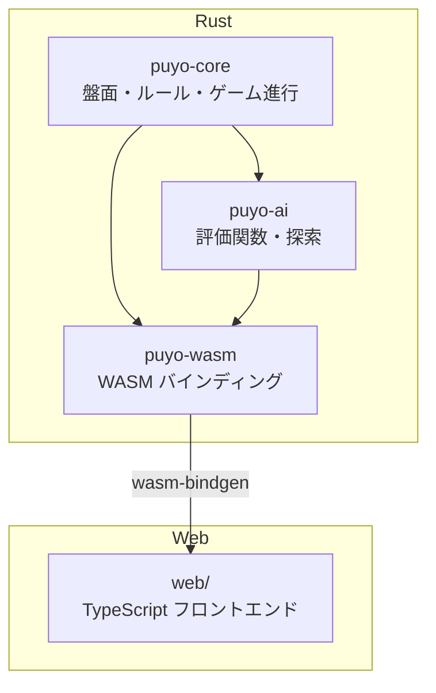
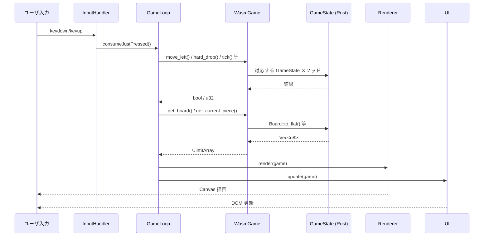
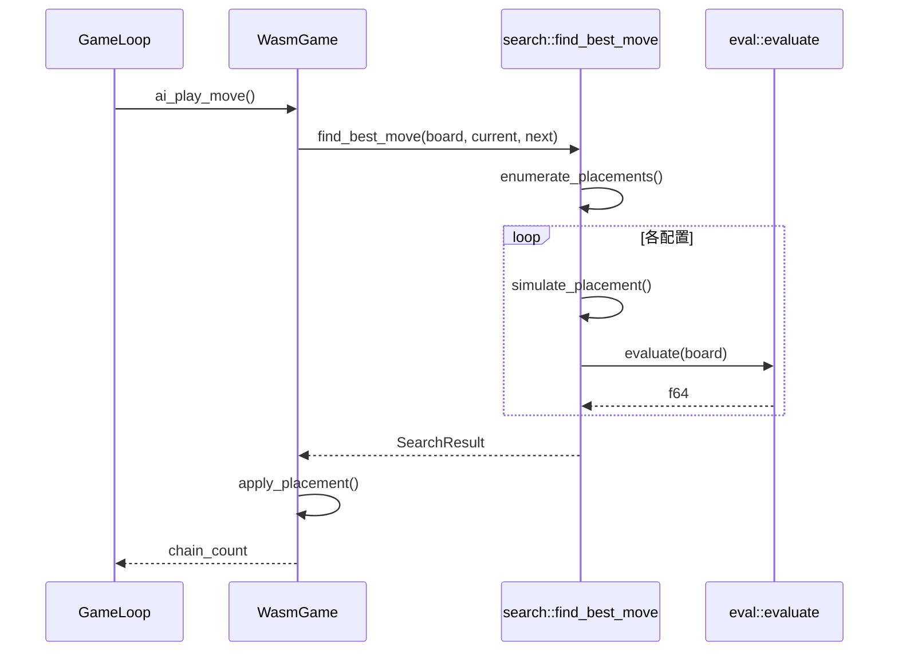
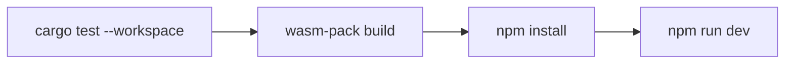

# システムアーキテクチャ

| 項目 | 値 |
|------|-----|
| ステータス | 実装済み |
| クレート | 全体 |
| 最終更新 | 2026-02-13 |
| 対応ソース | `Cargo.toml`, `scripts/build-wasm.sh`, `web/vite.config.ts` |

## 構成概要

3つの Rust クレート + 1つの TypeScript フロントエンドで構成される。



### puyo-core (基盤クレート)

| モジュール | 責務 |
|-----------|------|
| `board` | 盤面データ構造、PuyoColor、重力、ゲームオーバー判定 |
| `piece` | ぷよ組、方向、配置、落下ピース、移動・回転 |
| `chain` | 連鎖検出（BFS flood-fill）、連鎖解決ループ |
| `score` | スコア計算（ボーナステーブル） |
| `game` | ゲーム状態管理、フェーズ遷移、tick |
| `rng` | Xorshift64 乱数生成 |

外部依存: なし（`std` のみ）

### puyo-ai (AI クレート)

| モジュール | 責務 |
|-----------|------|
| `eval` | 盤面評価関数（8項目の重み付き評価） |
| `search` | 深さ1/2探索、最善手探索 |
| `placement` | 合法配置列挙、同色重複排除 |

依存: `puyo-core`

### puyo-wasm (WASM ブリッジクレート)

| モジュール | 責務 |
|-----------|------|
| `lib` | WasmGame ラッパー、JS バインディング |

依存: `puyo-core`, `puyo-ai`, `wasm-bindgen`

クレートタイプ: `cdylib`（動的ライブラリ）+ `rlib`（テスト用）

### web (フロントエンド)

| ファイル | 責務 |
|---------|------|
| `main.ts` | エントリポイント、初期化 |
| `wasm.ts` | WASM モジュールの動的ロード |
| `types.ts` | WasmGame の TypeScript 型定義 |
| `constants.ts` | 共有定数（色、サイズ、速度） |
| `game-loop.ts` | ゲームループ（60fps）、入力ディスパッチ |
| `input.ts` | キーボード入力ハンドラ |
| `renderer.ts` | Canvas 2D レンダリング |
| `ui.ts` | DOM ベースの UI 更新 |

依存: Vite, `vite-plugin-wasm`, `vite-plugin-top-level-await`

## データフロー



### AI モードのデータフロー



## ビルドパイプライン

`scripts/build-wasm.sh` による統一ビルド:



### 手順

1. **テスト実行**: `cargo test --workspace` — 全クレートのテストを実行
2. **WASM ビルド**: `wasm-pack build crates/puyo-wasm --target web --out-dir web/wasm-pkg`
   - `--target web`: ESM モジュールとして生成
   - `--out-dir`: web ディレクトリ直下に出力
3. **依存インストール**: `cd web && npm install`
4. **開発サーバ**: `npm run dev`（Vite 開発サーバ）

### Vite 設定

```typescript
// web/vite.config.ts
export default defineConfig({
  plugins: [wasm(), topLevelAwait()],
  build: { target: "esnext" },
});
```

- `vite-plugin-wasm`: WASM ファイルの ESM インポートをサポート
- `vite-plugin-top-level-await`: トップレベル await のサポート
- `target: "esnext"`: 最新 JS 機能を使用（WASM 対応ブラウザを前提）

## ワークスペース構成

```toml
# Cargo.toml (ルート)
[workspace]
members = [
    "crates/puyo-core",
    "crates/puyo-ai",
    "crates/puyo-wasm",
]
resolver = "2"
```

Cargo ワークスペースにより3クレートを統合管理。
