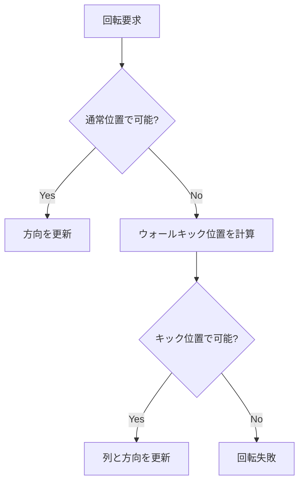

# ぷよ組・ツモ仕様

| 項目 | 値 |
|------|-----|
| ステータス | 実装済み |
| クレート | puyo-core |
| 最終更新 | 2026-02-13 |
| 対応ソース | `crates/puyo-core/src/piece.rs` |

## Orientation 列挙型

衛星ぷよの軸ぷよに対する相対位置を表す。

| バリアント | 衛星の位置 | オフセット (dcol, drow) |
|-----------|-----------|------------------------|
| `North` | 軸の上 | (0, +1) |
| `East` | 軸の右 | (+1, 0) |
| `South` | 軸の下 | (0, -1) |
| `West` | 軸の左 | (-1, 0) |

### 回転

| メソッド | 遷移 |
|----------|------|
| `rotate_cw` | N→E→S→W→N |
| `rotate_ccw` | N→W→S→E→N |

## Piece 構造体

```rust
pub struct Piece {
    pub axis_color: PuyoColor,
    pub satellite_color: PuyoColor,
}
```

2個1組のぷよ。`axis_color` が回転中心（軸ぷよ）、`satellite_color` が周回ぷよ（衛星ぷよ）。

## Placement 構造体

```rust
pub struct Placement {
    pub col: usize,           // 軸ぷよの列 (0-5)
    pub orientation: Orientation,
}
```

配置指定。AI が探索結果を表現するために使用。

### satellite_col メソッド

```rust
pub fn satellite_col(&self) -> Option<usize>
```

衛星ぷよの列を計算。列が 0 未満または 6 以上になる場合は `None` を返す。

## FallingPiece 構造体

```rust
pub struct FallingPiece {
    pub piece: Piece,
    pub col: usize,            // 軸ぷよの列
    pub row: f32,              // 軸ぷよの行（小数点以下はスムーズ落下用）
    pub orientation: Orientation,
}
```

ゲームプレイ中の落下中ぷよ組の状態。

### 出現位置

`FallingPiece::spawn(piece)` で生成:

| フィールド | 初期値 |
|-----------|--------|
| `col` | 2（3列目） |
| `row` | 12.0（可視領域の上端） |
| `orientation` | `North`（衛星が上） |

### 移動

| メソッド | 説明 |
|----------|------|
| `try_move_left(&mut self, col_heights: &[usize; 6]) -> bool` | 左に1マス移動。成功時 `true` |
| `try_move_right(&mut self, col_heights: &[usize; 6]) -> bool` | 右に1マス移動。成功時 `true` |

移動前に `can_occupy` で境界チェックを行う:
- 軸ぷよの列が 0〜5 の範囲内
- 衛星ぷよの列が 0〜5 の範囲内
- 行が 0 以上

### 回転 + ウォールキック

| メソッド | 説明 |
|----------|------|
| `try_rotate_cw(&mut self, col_heights: &[usize; 6]) -> bool` | 時計回り回転 |
| `try_rotate_ccw(&mut self, col_heights: &[usize; 6]) -> bool` | 反時計回り回転 |

回転アルゴリズム:

1. 新しい方向で `can_occupy` を判定
2. 成功 → 方向を更新して `true`
3. 失敗 → **ウォールキック**: 衛星の方向と逆方向に軸を1マスシフト（`kick_col = col - dc`）
4. シフト後に `can_occupy` を再判定
5. 成功 → 列と方向を更新して `true`
6. 失敗 → `false`（回転不可）



## テスト要件

| テスト | 検証内容 |
|--------|---------|
| `test_orientation_rotation` | CW/CCW 回転の遷移が正しい |
| `test_placement_satellite_col` | 各方向の衛星列計算と範囲外チェック |
| `test_falling_piece_spawn` | 出現位置が col=2, orientation=North |
| `test_move_left_right` | 左右移動と壁際での移動失敗 |
| `test_rotate_wall_kick` | 壁際でのウォールキック動作 |
