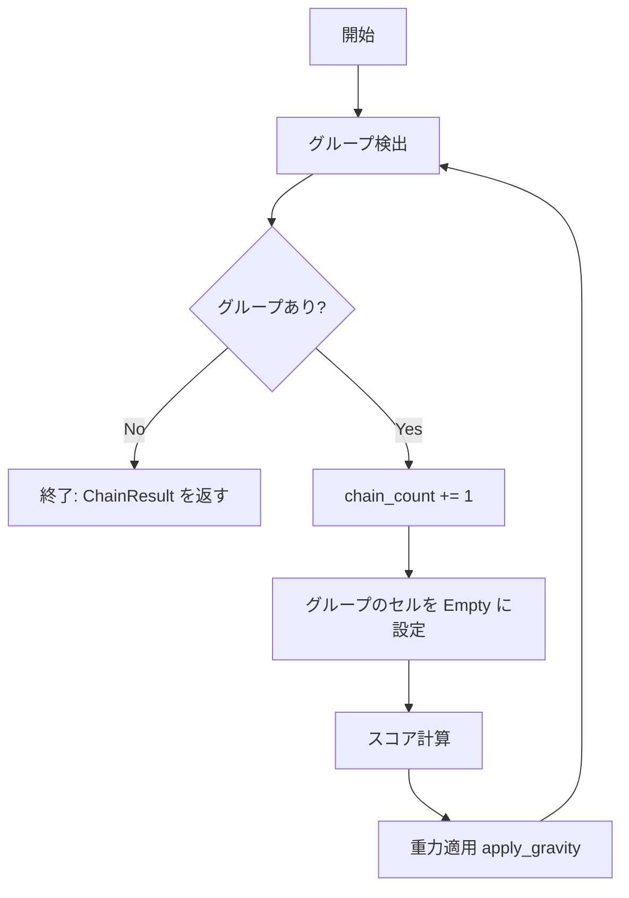

# 連鎖処理仕様

| 項目 | 値 |
|------|-----|
| ステータス | 実装済み |
| クレート | puyo-core |
| 最終更新 | 2026-02-13 |
| 対応ソース | `crates/puyo-core/src/chain.rs` |

## データ構造

### Group

```rust
pub struct Group {
    pub color: PuyoColor,
    pub cells: Vec<(usize, usize)>,  // (col, row)
}
```

同色で4個以上連結したぷよのグループ。

### ChainStep

```rust
pub struct ChainStep {
    pub chain_num: u32,        // 1始まりの連鎖番号
    pub groups: Vec<Group>,    // この段階で消去されたグループ一覧
    pub score: u32,            // この段階のスコア
}
```

1回の同時消去を表す。

### ChainResult

```rust
pub struct ChainResult {
    pub chain_count: u32,      // 総連鎖数
    pub score: u32,            // 総スコア
    pub steps: Vec<ChainStep>, // 各段階の詳細
}
```

連鎖処理全体の結果。

## グループ探索: find_groups

BFS flood-fill アルゴリズムで同色連結グループを検出する。

### アルゴリズム

1. 全セルを未訪問で初期化
2. 各セルを走査し、色ぷよかつ未訪問ならBFS開始
3. BFS: キューから取り出し、4方向（上下左右）の隣接セルを調べる
4. 同色かつ未訪問なら訪問済みにしてキューに追加
5. グループのセル数が4以上なら結果に追加

### 隣接方向

```
(-1, 0)  左
(+1, 0)  右
(0, -1)  下
(0, +1)  上
```

## 連鎖解決: resolve_chains

盤面を in-place で変更し、連鎖が完了するまでループする。



### 処理手順

1. `find_groups(board)` でグループを検出
2. グループが空なら終了
3. `chain_count` をインクリメント
4. 各グループのセルを `PuyoColor::Empty` に設定
5. `calculate_step_score(chain_count, &groups)` でスコア計算
6. `board.apply_gravity()` で重力適用
7. ステップ1に戻る

### 連鎖の例

2連鎖の構成例:

```
初期状態:         1連鎖後（赤消去）:  重力適用後:      2連鎖（青消去）:
Col 0: B B B      Col 0: B B B       Col 0: B B B B   Col 0: (empty)
Col 1: R R R R B  Col 1: B           Col 1: B         Col 1: (empty)
```

1. Col 1 の赤4個が消去される（1連鎖目）
2. Col 1 の青が落下して Col 0 の青3個と連結（4個）
3. 青4個が消去される（2連鎖目）

## テスト要件

| テスト | 検証内容 |
|--------|---------|
| `test_no_chain` | 4個未満の配置では連鎖が発生しない |
| `test_single_group_clear` | 縦4個の単発消去 |
| `test_horizontal_group` | 横4個の単発消去 |
| `test_two_chain` | 2連鎖の発生と盤面クリア |
| `test_gravity_after_clear` | 消去後の重力でぷよが正しく落下 |
| `test_l_shape_group` | L字型4個の連結検出 |
