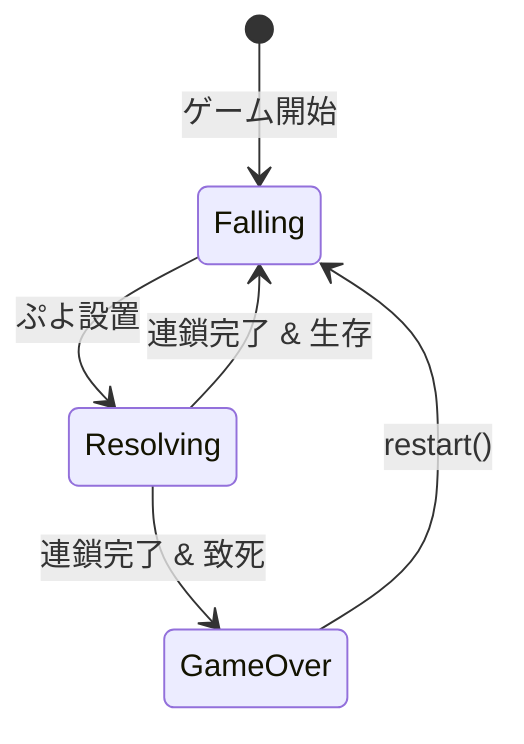
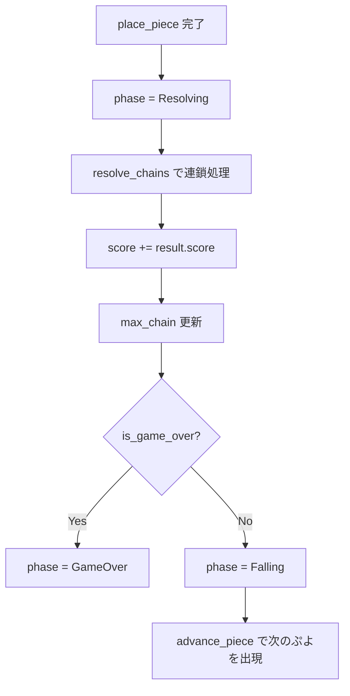

# ゲーム進行・状態管理仕様

| 項目 | 値 |
|------|-----|
| ステータス | 実装済み |
| クレート | puyo-core |
| 最終更新 | 2026-02-13 |
| 対応ソース | `crates/puyo-core/src/game.rs` |

## GamePhase 列挙型

```rust
pub enum GamePhase {
    Falling,    // プレイヤーがぷよ組を操作中
    Resolving,  // 設置後、連鎖を解決中
    GameOver,   // ゲーム終了
}
```

### 状態遷移図



## GameState 構造体

```rust
pub struct GameState {
    pub board: Board,
    pub current_piece: Option<FallingPiece>,
    pub next_piece: Piece,
    pub score: u32,
    pub max_chain: u32,
    pub phase: GamePhase,
    pub rng: Rng,
    pub total_pieces: u32,
}
```

| フィールド | 型 | 説明 |
|-----------|-----|------|
| `board` | `Board` | 現在の盤面状態 |
| `current_piece` | `Option<FallingPiece>` | 操作中のぷよ組。Resolving/GameOver 時は `None` |
| `next_piece` | `Piece` | 次のぷよ組（ネクスト表示用） |
| `score` | `u32` | 累計スコア |
| `max_chain` | `u32` | 最大連鎖数 |
| `phase` | `GamePhase` | 現在のゲームフェーズ |
| `rng` | `Rng` | 乱数生成器 |
| `total_pieces` | `u32` | 設置済みぷよ組数 |

## 初期化フロー

`GameState::new(seed: u64)`:

1. `Rng::new(seed)` で乱数生成器を初期化
2. `generate_piece(&mut rng)` で current ピースを生成
3. `generate_piece(&mut rng)` で next ピースを生成
4. 空の `Board` を作成
5. `spawn_piece(current)` で current ピースを出現させる
6. `phase = Falling`, `score = 0`, `max_chain = 0`

### ぷよ生成

```rust
fn generate_piece(rng: &mut Rng) -> Piece {
    let axis = PuyoColor::from_u8(rng.next_range(4) as u8 + 1);
    let satellite = PuyoColor::from_u8(rng.next_range(4) as u8 + 1);
    Piece::new(axis, satellite)
}
```

4色（Red=1, Green=2, Blue=3, Yellow=4）からそれぞれ独立にランダム選択。

## 操作 API

全操作は `phase == Falling` の場合のみ有効。それ以外は `false` を返す。

| メソッド | 説明 |
|----------|------|
| `move_left() -> bool` | 左移動 |
| `move_right() -> bool` | 右移動 |
| `rotate_cw() -> bool` | 時計回り回転 |
| `rotate_ccw() -> bool` | 反時計回り回転 |
| `hard_drop() -> Option<ChainResult>` | ハードドロップ（即時設置） |
| `soft_drop() -> bool` | 1行下に移動。着地判定で `false` |
| `tick(gravity: f32) -> Option<ChainResult>` | 重力による落下。着地時にハードドロップ |

## 設置ロジック: place_piece

ぷよ組の方向に応じて設置順序が異なる。

### North（衛星が上）

1. 軸ぷよを `drop_puyo(col, axis_color)` で先に設置
2. 衛星ぷよを `drop_puyo(col, satellite_color)` で後に設置（軸の上に積まれる）

### South（衛星が下）

1. 衛星ぷよを `drop_puyo(col, satellite_color)` で先に設置
2. 軸ぷよを `drop_puyo(col, axis_color)` で後に設置（衛星の上に積まれる）

### East / West（横並び）

1. 軸ぷよを `drop_puyo(col, axis_color)` で設置
2. 衛星ぷよを `drop_puyo(sat_col, satellite_color)` で設置

※ `sat_col = col + dc`（East: +1, West: -1）

## 連鎖解決フロー: resolve



## tick（重力制御）

`tick(gravity: f32) -> Option<ChainResult>`:

1. `phase != Falling` なら `None`
2. 着地行を計算（方向別）:
   - **North**: 軸列の高さ
   - **South**: 衛星列の高さ
   - **East/West**: 両列の高さの最大値
3. `new_row = fp.row - gravity`
4. `new_row <= landing_row` なら `hard_drop()` を実行
5. そうでなければ `fp.row = new_row` で位置更新

## その他メソッド

| メソッド | 説明 |
|----------|------|
| `apply_placement(&mut self, placement: &Placement) -> ChainResult` | AI用: 配置を直接適用して連鎖解決 |
| `restart(&mut self, seed: u64)` | ゲームをリセット |
| `get_current_piece_info() -> Option<(u8, u8, u8, f32, u8)>` | 現在ピース情報（描画用） |
| `get_next_piece_info() -> (u8, u8)` | ネクストピース情報 |

## テスト要件

| テスト | 検証内容 |
|--------|---------|
| `test_new_game` | 初期状態: Falling, current_piece あり, score=0, max_chain=0 |
| `test_hard_drop_and_next` | ハードドロップ後にネクストピースが current に繰り上がる |
| `test_deterministic_game` | 同じシードで同じ操作列 → 同じ結果 |
| `test_move_operations` | 左右移動・CW回転の正常動作 |
| `test_restart` | restart 後にスコア・max_chain・phase がリセット |
