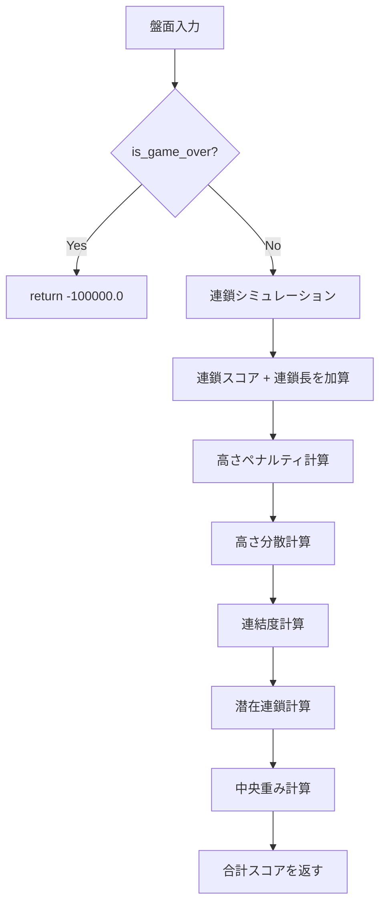

# AI 評価関数仕様

| 項目 | 値 |
|------|-----|
| ステータス | 実装済み |
| クレート | puyo-ai |
| 最終更新 | 2026-02-13 |
| 対応ソース | `crates/puyo-ai/src/eval.rs` |

## 概要

盤面の「良さ」を数値化する評価関数。AI が配置を選択する際の判断基準となる。スコアが高いほど良い盤面とみなす。

## 評価項目と重み

| # | 評価項目 | 重み定数 | 値 | 説明 |
|---|---------|---------|-----|------|
| 1 | 連鎖スコア | `W_CHAIN_SCORE` | 1.0 | 連鎖シミュレーション後のスコア |
| 2 | 連鎖長 | `W_CHAIN_LENGTH` | 50.0 | 連鎖数（長い連鎖を高評価） |
| 3 | 高さペナルティ | `W_HEIGHT_PENALTY` | -5.0 | 高い列への負の評価 |
| 4 | 高さ分散 | `W_HEIGHT_VARIANCE` | -3.0 | 列高さの不均一さへのペナルティ |
| 5 | 連結度 | `W_CONNECTIVITY` | 2.0 | 同色隣接ペアの数 |
| 6 | 潜在連鎖 | `W_POTENTIAL_CHAIN` | 15.0 | 3個/2個の連結グループ数 |
| 7 | 中央重み | `W_CENTER_WEIGHT` | 1.0 | 中央列のぷよ優遇 |
| 8 | ゲームオーバー | `W_GAME_OVER` | -100000.0 | 致死状態への極大ペナルティ |

## 評価手順

`evaluate(board: &Board) -> f64`:



### 1. ゲームオーバー判定

盤面がゲームオーバー状態なら即座に `W_GAME_OVER`（-100000.0）を返す。

### 2. 連鎖シミュレーション

盤面をクローンして `resolve_chains` を実行。結果のスコアと連鎖数を評価に加算:

```
score += chain_result.score × W_CHAIN_SCORE
score += chain_result.chain_count × W_CHAIN_LENGTH
```

以降の評価は**連鎖解決後の盤面**に対して行う。

### 3. 高さペナルティ

最大列高さに基づく段階的ペナルティ:

| 条件 | ペナルティ |
|------|-----------|
| max_height > 8 | `(max_height - 8) × W_HEIGHT_PENALTY × 2` |
| max_height > 10 | 上記に加え `(max_height - 10) × W_HEIGHT_PENALTY × 10` |

例: max_height = 11 の場合:
- (11-8) × (-5.0) × 2 = -30.0
- (11-10) × (-5.0) × 10 = -50.0
- 合計: -80.0

### 4. 高さ分散

```
avg_height = Σ heights / COLS
variance = Σ (height - avg_height)² / COLS
score += variance × W_HEIGHT_VARIANCE
```

列の高さが均一なほど分散が小さく、ペナルティが軽減される。

### 5. 連結度 (count_connectivity)

全セルを走査し、右隣と上隣が同色ならカウント:

```
各セル(col, row)について:
  if board[col+1][row] == board[col][row] → count += 1
  if board[col][row+1] == board[col][row] → count += 1
```

### 6. 潜在連鎖 (count_potential_chains)

BFS/DFS で連結グループを検出し、以下のサイズのグループをカウント:

| グループサイズ | カウント |
|--------------|---------|
| 3（あと1個で消去） | +1 |
| 2（連結ペア） | +1 |

4個以上は連鎖シミュレーションで消去済みのため対象外。

### 7. 中央重み (count_center_weight)

列ごとに重み付けした高さの合計:

| 列 | 0 | 1 | 2 | 3 | 4 | 5 |
|----|---|---|---|---|---|---|
| 重み | 0.5 | 0.8 | 1.0 | 1.0 | 0.8 | 0.5 |

```
center_weight = Σ column_height(col) × weights[col]
```

## evaluate_placement

```rust
pub fn evaluate_placement(board: &Board) -> f64 {
    evaluate(board)
}
```

`evaluate` と同一。配置後の盤面を評価する際の名目的なエントリポイント。

## テスト要件

| テスト | 検証内容 |
|--------|---------|
| `test_empty_board_eval` | 空盤面の評価値がほぼ0（\|score\| < 100） |
| `test_game_over_eval` | ゲームオーバー盤面 → -10000.0 未満 |
| `test_chain_rewards_higher` | 4個消去可能な盤面 > 散らばった4個の盤面 |
| `test_connectivity_bonus` | 同色隣接3個 > 異色3個の連結度 |
