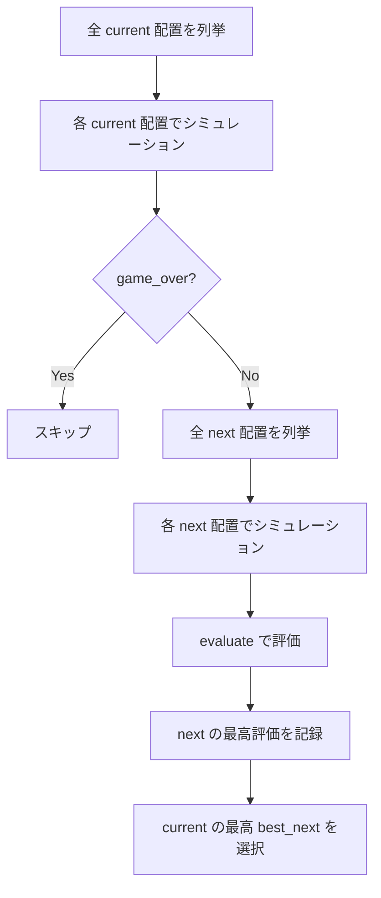
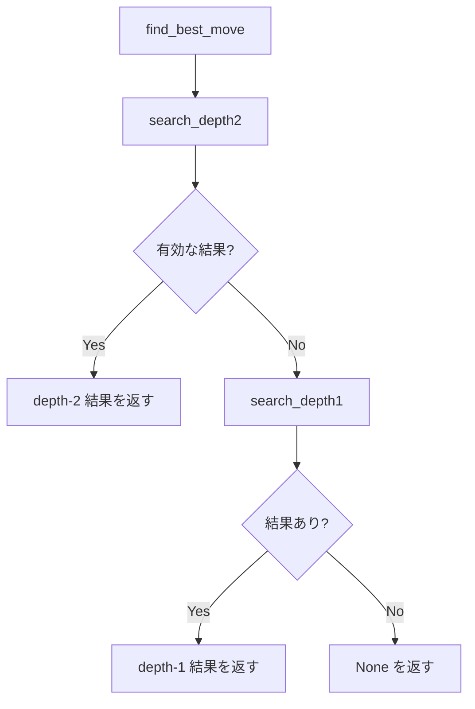

# AI 探索アルゴリズム仕様

| 項目 | 値 |
|------|-----|
| ステータス | 実装済み |
| クレート | puyo-ai |
| 最終更新 | 2026-02-13 |
| 対応ソース | `crates/puyo-ai/src/search.rs`, `crates/puyo-ai/src/placement.rs` |

## 概要

全配置列挙 + 評価関数による探索。深さ2（current + next ピース）の先読みを行い、最高評価の配置を選択する。

## 配置列挙: enumerate_placements

`enumerate_placements(board: &Board, piece: &Piece) -> Vec<Placement>`

### 列挙ルール

| 方向 | 軸列の範囲 | 条件 | 最大数 |
|------|-----------|------|--------|
| North | 0〜5 | 軸列の高さ+2 ≤ ROWS | 6 |
| South | 0〜5 | 軸列の高さ+2 ≤ ROWS | 6 |
| East | 0〜4 | 軸列・衛星列ともに高さ < ROWS | 5 |
| West | 1〜5 | 軸列・衛星列ともに高さ < ROWS | 5 |

**最大配置数**: 6 + 6 + 5 + 5 = **22手**

### 同色重複排除

`axis_color == satellite_color` の場合、以下の重複を排除:

- **North と South**: 同じ列なら結果が同一 → 片方を排除
- **East(col) と West(col+1)**: 同じ2列ペア → 片方を排除

正規化キー `(min_col, max_col, is_vertical)` で重複を検出。

**同色時の最大配置数**: 6 + 5 = **11手**

## 探索結果

```rust
pub struct SearchResult {
    pub best_placement: Placement,
    pub score: f64,
    pub depth: u32,
}
```

## 深さ1探索: search_depth1

```rust
pub fn search_depth1(board: &Board, current: &Piece) -> Option<SearchResult>
```

### アルゴリズム

1. `enumerate_placements(board, current)` で全配置を列挙
2. 各配置について:
   a. `simulate_placement(board, current, placement)` で盤面をシミュレーション
   b. `evaluate(&result_board)` で評価値を算出
3. 最高評価値の配置を返す

### simulate_placement

```rust
fn simulate_placement(board: &Board, piece: &Piece, placement: &Placement) -> Board
```

1. 空の `GameState` を作成（seed=0）
2. 入力盤面をクローンして設定
3. `place_piece` でぷよを設置
4. `resolve_chains` で連鎖を解決
5. 結果の盤面を返す

## 深さ2探索: search_depth2

```rust
pub fn search_depth2(board: &Board, current: &Piece, next: &Piece) -> Option<SearchResult>
```

### アルゴリズム



1. `enumerate_placements(board, current)` で current の全配置を列挙
2. 各 current 配置について:
   a. `simulate_placement` で current 配置後の盤面を取得
   b. ゲームオーバーならスキップ
   c. `enumerate_placements(board_after_current, next)` で next の全配置を列挙
   d. 各 next 配置をシミュレーション → 評価
   e. next の最高評価値を `best_next_score` として記録
3. `best_next_score` が最高の current 配置を返す

### 探索戦略: max-max

current と next の両方で最良の結果を追求する楽観的戦略。相手の妨害がない1人プレイに適している。

### 計算量

- current 配置数: 最大22
- next 配置数: 最大22（各 current 配置後の盤面に対して）
- 合計評価回数: 最大 22 × 22 = **484回**

## メインエントリ: find_best_move

```rust
pub fn find_best_move(board: &Board, current: &Piece, next: &Piece) -> Option<SearchResult>
```

1. `search_depth2` を試行
2. 結果のスコアが `NEG_INFINITY` でなければ採用
3. 失敗時（全配置がゲームオーバー等）は `search_depth1` にフォールバック



## テスト要件

| テスト | 検証内容 |
|--------|---------|
| `test_depth1_finds_move` | 空盤面で depth-1 が配置を見つける |
| `test_depth2_finds_move` | 空盤面で depth-2 が配置を見つける |
| `test_ai_avoids_game_over` | 高く積まれた盤面でもゲームオーバーを避ける配置を選択 |
| `test_ai_prefers_chain` | 3個揃った列に4個目を置いて連鎖を優先 |
