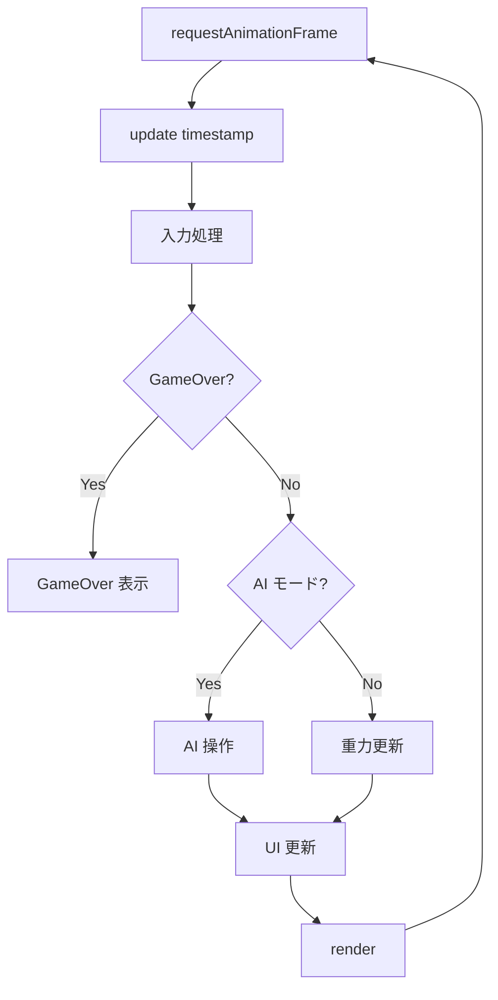
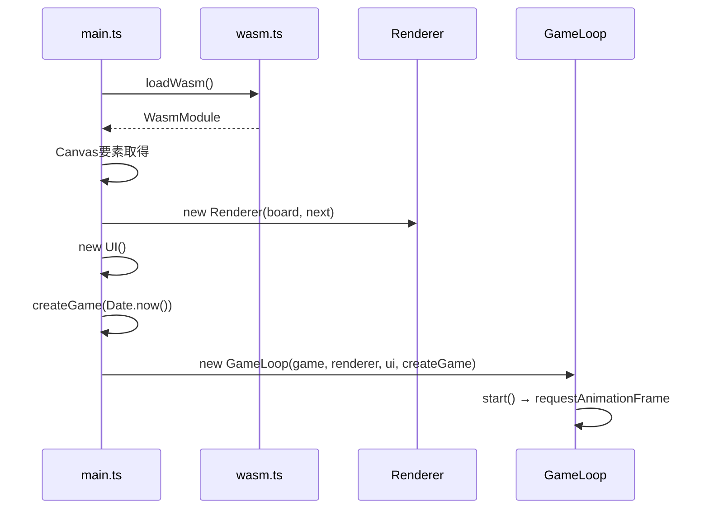

# フロントエンド仕様

| 項目 | 値 |
|------|-----|
| ステータス | 実装済み |
| クレート | web |
| 最終更新 | 2026-02-13 |
| 対応ソース | `web/src/main.ts`, `web/src/game-loop.ts`, `web/src/renderer.ts`, `web/src/input.ts`, `web/src/ui.ts`, `web/src/constants.ts`, `web/src/types.ts`, `web/src/wasm.ts` |

## 定数一覧

### 盤面定数

| 定数 | 値 | 説明 |
|------|-----|------|
| `COLS` | 6 | 列数 |
| `ROWS` | 14 | 行数（内部） |
| `VISIBLE_ROWS` | 12 | 可視行数 |
| `CELL_SIZE` | 40px | 1セルの描画サイズ |
| `BOARD_WIDTH` | 240px | 盤面幅 (6×40) |
| `BOARD_HEIGHT` | 480px | 盤面高さ (12×40) |

### 色定数

| PuyoColor | 基本色 | ハイライト色 |
|-----------|--------|-------------|
| Red (1) | `#e94560` | `#ff7b93` |
| Green (2) | `#4ade80` | `#86efac` |
| Blue (3) | `#60a5fa` | `#93c5fd` |
| Yellow (4) | `#fbbf24` | `#fcd34d` |

### ゲーム速度

| 定数 | 値 | 説明 |
|------|-----|------|
| `GRAVITY_NORMAL` | 0.05 cells/frame | 通常落下速度 |
| `GRAVITY_FAST` | 1.0 cells/frame | ソフトドロップ時 |
| `AI_PLAY_INTERVAL` | 200ms | AI の手間隔 |

## 入力システム (InputHandler)

### キーマッピング

| キー | アクション |
|------|-----------|
| `ArrowLeft` | `move_left` |
| `ArrowRight` | `move_right` |
| `ArrowUp` | `rotate_cw` |
| `KeyX` | `rotate_cw` |
| `KeyZ` | `rotate_ccw` |
| `ArrowDown` | `soft_drop` |
| `Space` | `hard_drop` |
| `KeyA` | `toggle_ai` |
| `KeyR` | `restart` |

### キーリピート防止

`held` セットでキーの押下状態を管理:

1. `keydown` 時: `held` に `e.code` があれば無視（リピート防止）
2. `held` に追加、`justPressed` と `actions` に追加
3. `keyup` 時: `held` から削除、`actions` から削除

### API

| メソッド | 説明 |
|----------|------|
| `consumeJustPressed(): InputAction[]` | このフレームで新規押下されたアクションを取得してクリア |
| `isHeld(action): boolean` | アクションが押下中かどうか |

## ゲームループ (GameLoop)

`requestAnimationFrame` ベースの 60fps ループ。

### ループ構造



### 入力処理の優先順序

1. `toggle_ai` / `restart` はフェーズに関係なく処理
2. `restart` 時は即座にリスタートして `return`
3. GameOver 中はゲーム操作を無視
4. AI モード OFF 時のみプレイヤー操作を受け付け

### AI モード

- `toggle_ai` で ON/OFF 切り替え
- ON 時: `AI_PLAY_INTERVAL`（200ms）ごとに `ai_play_move()` を呼び出し
- ON 時: 重力処理（`tick`）はスキップ（AI は即時配置のため）

### 重力制御

手動モード時のみ `tick(gravity)` を呼び出し:

```typescript
const gravity = this.input.isHeld("soft_drop")
  ? GRAVITY_FAST    // 1.0
  : GRAVITY_NORMAL; // 0.05
```

### リスタート

```typescript
private restart(): void {
    const seed = BigInt(Date.now());
    this.game.free();
    this.game = this.createGame(seed);
    this.gameOverShown = false;
    this.ui.hideGameOver();
    this.ui.update(this.game);
}
```

`Date.now()` を新しいシードとして使用。古い WasmGame は `free()` で解放。

## レンダリング (Renderer)

Canvas 2D API による描画。

### 描画要素

1. **盤面背景**: `#0f0f23` で塗りつぶし
2. **グリッド線**: `#1a1a3e`、0.5px 幅
3. **盤面ぷよ**: 列優先で各セルを描画（行0=最下段なので Y 座標を反転）
4. **落下中ピース**: 軸ぷよと衛星ぷよを描画
5. **ゴースト**: ハードドロップ先の位置を半透明（alpha=0.25）で表示
6. **ネクスト表示**: 別キャンバスに North 方向で描画

### ぷよの描画 (drawPuyo)

```
定数:
  PUYO_RADIUS = CELL_SIZE × 0.42 = 16.8px
  EYE_RADIUS = 3px
  EYE_OFFSET_X = 5px
  EYE_OFFSET_Y = -4px
```

描画手順:
1. **メイン円**: 基本色で塗りつぶし
2. **ハイライト**: ラジアルグラデーション（左上から中心へ、ハイライト色 → 透明）
3. **白目**: 2つの白い円（EYE_OFFSET で配置）
4. **瞳**: 白目の中に黒い小円（半径1.5px、右に1pxオフセット）

### ゴースト表示 (drawGhost)

盤面データから各列の高さを算出し、方向に応じた着地位置を計算:

| 方向 | 軸行 | 衛星行 |
|------|------|--------|
| North (上) | h | h + 1 |
| South (下) | h + 1 | h |
| East/West | getHeight(col) | getHeight(satCol) |

`globalAlpha = 0.25` で半透明描画。

### ネクスト表示 (drawNext)

80×80px のキャンバスに North 方向で描画:
- 衛星ぷよ: (40, 20)
- 軸ぷよ: (40, 56)

背景色: `#16213e`

## UI (UI クラス)

DOM 要素を直接操作。

### 表示要素

| 要素 ID | 表示内容 |
|---------|---------|
| `score-display` | スコア（カンマ区切り） |
| `chain-display` | 最大連鎖数 |
| `pieces-display` | 設置済みピース数 |
| `ai-status` | AI の ON/OFF 状態 |
| `game-over-overlay` | ゲームオーバー画面 |
| `final-score` | ゲームオーバー時の最終スコア |
| `final-chain` | ゲームオーバー時の最大連鎖数 |

### ゲームオーバーオーバーレイ

`show` クラスの追加/削除で表示切替。

## 起動フロー (main.ts)


