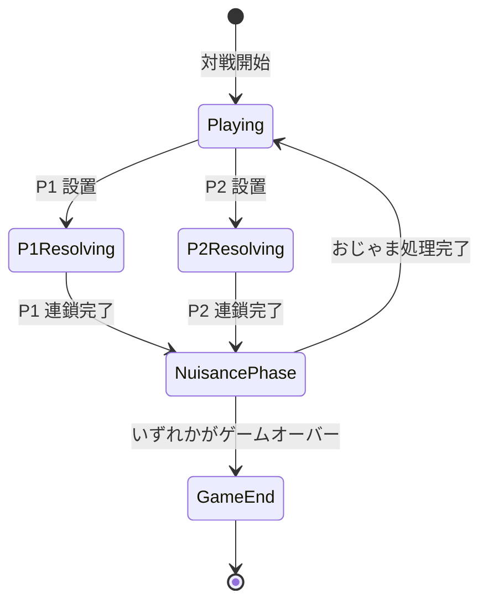

# 対戦・おじゃまぷよ仕様（未実装）

| 項目 | 値 |
|------|-----|
| ステータス | 未実装 |
| クレート | puyo-core / puyo-wasm / web |
| 最終更新 | 2026-02-13 |
| 対応ソース | — |

## 概要

2プレイヤー対戦モードの設計仕様。おじゃまぷよの送受信、相殺ルール、対戦状態管理を定義する。

## PuyoColor の拡張

既存の4色に加え、おじゃまぷよ用の色を追加する。

| バリアント | 値 | 説明 |
|-----------|-----|------|
| `Empty` | 0 | 空セル |
| `Red` | 1 | 赤 |
| `Green` | 2 | 緑 |
| `Blue` | 3 | 青 |
| `Yellow` | 4 | 黄 |
| `Nuisance` | 5 | おじゃまぷよ（追加） |

### おじゃまぷよの特性

- 同色連結しても消去されない（`is_color()` で `true` だが連鎖対象外）
- 隣接する色ぷよの消去に巻き込まれて消える
- 連鎖の find_groups 対象外とし、消去フェーズで別途処理

## おじゃまぷよ計算

### 送信量

```
おじゃまぷよ数 = floor(連鎖スコア / おじゃまレート)
```

| 定数 | 値 | 説明 |
|------|-----|------|
| `NUISANCE_RATE` | 70 | おじゃまぷよ1個あたりのスコア |

### 相殺ルール

1. プレイヤーAが連鎖で送信したおじゃまぷよ数を計算
2. プレイヤーAの「予告おじゃま」キューにある受信分と相殺
3. 相殺後の余りを相手（プレイヤーB）の予告キューに追加
4. 連鎖が終了し、予告キューにおじゃまが残っていれば盤面に落下

### おじゃまぷよの落下

- 1段（6個）単位で上から均等に落下
- 端数は左から順に落下
- 落下後に連鎖判定は行わない

## MatchState 構造体

```rust
pub struct MatchState {
    pub player1: GameState,
    pub player2: GameState,
    pub nuisance_queue_p1: u32,  // P1 への予告おじゃま
    pub nuisance_queue_p2: u32,  // P2 への予告おじゃま
    pub winner: Option<u8>,      // None=進行中, Some(1)=P1勝利, Some(2)=P2勝利
}
```

### 状態遷移



## ネットワーク対戦（将来構想）

### 設計方針

- **ロックステップ方式**: 両プレイヤーの入力を同期して進行
- **通信プロトコル**: WebSocket を使用
- **同期データ**: 操作コマンド（移動・回転・ドロップ）のみを送受信
- **乱数同期**: 同一シードを共有し、決定論的に同じツモ列を生成

### 課題

- レイテンシ補償
- 切断時のリカバリ
- チート防止（サーバサイドバリデーション）
