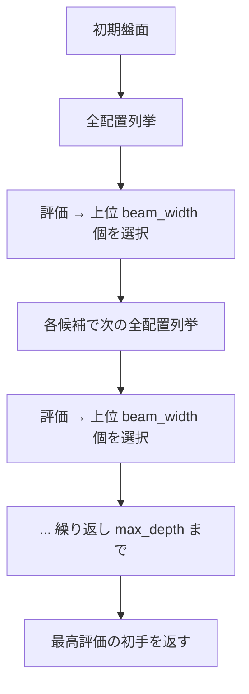

# 高度 AI 探索仕様（未実装）

| 項目 | 値 |
|------|-----|
| ステータス | 未実装 |
| クレート | puyo-ai |
| 最終更新 | 2026-02-13 |
| 対応ソース | — |

## 概要

現行の深さ2全探索を超えるAI強化の設計仕様。探索アルゴリズムの改良、評価関数のチューニング、形状パターン認識、難易度プリセットを定義する。

## 探索アルゴリズムの拡張

### ビームサーチ

現行の全探索は深さが増すと指数的に計算量が増大する。ビームサーチにより探索幅を制限する。

```
パラメータ:
  beam_width: 各深さで保持する候補数（例: 50）
  max_depth: 探索深さ（例: 5〜10）
```



### 深さ3以上の探索

深さ3の場合、next ピースの先も考慮する。ただし3手目のツモは不明のため：

- **楽観的推定**: 全色の平均評価を使用
- **代表サンプリング**: 数パターンのツモをランダムサンプリングして平均

### 反復深化

制限時間内で可能な限り深く探索する：

1. 深さ1で全配置を評価
2. 深さ2で再評価
3. 時間内なら深さ3…と繰り返し
4. 制限時間到達時の最新結果を採用

```
パラメータ:
  time_limit_ms: 探索制限時間（例: 100ms）
```

## 評価関数チューニング

### 手動チューニング

現行の重み定数をゲームプレイの分析に基づいて調整する。

| 調整項目 | 現行値 | 方向性 |
|---------|--------|--------|
| `W_CHAIN_LENGTH` | 50.0 | 連鎖重視なら増加 |
| `W_HEIGHT_PENALTY` | -5.0 | 安全重視なら絶対値増加 |
| `W_POTENTIAL_CHAIN` | 15.0 | 長期計画重視なら増加 |

### 自動チューニング

遺伝的アルゴリズムまたは局所探索による重みの自動最適化：

1. 重みベクトルの集団を生成
2. 各個体で N ゲームをプレイ（AI同士の対戦）
3. 平均スコア・連鎖数で適応度を評価
4. 選択・交叉・突然変異で次世代を生成
5. 収束まで繰り返し

### ML ベースの評価関数

ニューラルネットワークによる盤面評価の将来構想：

- 入力: 盤面の6×12×5テンソル（5チャンネル = 各色の有無）
- 出力: 評価スコア（スカラー）
- 学習: 自己対戦によるデータ生成 → 教師あり学習

## 形状パターン認識

定型的な連鎖の「形」を認識し、評価にボーナスを与える。

### GTR (Great Tanaka Rensa)

```
  [B][B]
[A][A][B]
[C][A][C]
```

最も基本的な折返しパターン。1〜2列目で折返しを構成。

### 新GTR

```
[B][A]
[A][A][B]
[C][C][B]
```

GTR の変形。別の色配置で折返しを構成。

### 折返し (Kaeshi)

連鎖の方向を反転させるパターン。盤面の左端または右端で構成。

### 実装方針

- パターンテンプレートを定義（相対座標 + 色の一致条件）
- 盤面を走査してテンプレートとのマッチ度を算出
- マッチ度に応じたボーナスを評価関数に加算

## AI 難易度プリセット

| プリセット | 探索深さ | beam_width | 評価の制限 | 特性 |
|-----------|---------|------------|-----------|------|
| 初級 | 1 | — | 連鎖評価を弱化 | 意図的にミスを許容 |
| 中級 | 2 | — | 現行と同等 | 現行のAI相当 |
| 上級 | 3+ | 50 | フル評価 + パターン認識 | 最強AI |

### 初級 AI の実装方針

- 一定確率でランダムな配置を選択（ε-greedy）
- 評価関数の重みを弱化（連鎖長ボーナスを削減）
- 探索深さを1に制限
