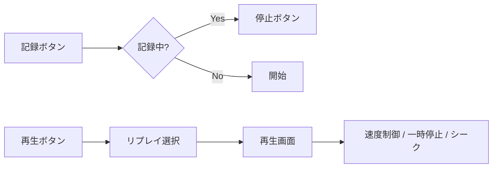

# リプレイシステム仕様（未実装）

| 項目 | 値 |
|------|-----|
| ステータス | 未実装 |
| クレート | puyo-core / web |
| 最終更新 | 2026-02-13 |
| 対応ソース | — |

## 概要

ゲームプレイを記録・再生するリプレイシステムの設計仕様。ゲームの決定論的性質を利用し、初期シードと操作列のみでゲームを完全に再現する。

## リプレイデータ形式

### 設計原則

- ゲームは決定論的（同じシード + 同じ操作列 → 同じ結果）
- したがって、**初期シード + 操作列**のみで完全に再現可能
- 盤面の全状態を保存する必要がない（データサイズの削減）

### データ構造

```rust
pub struct Replay {
    pub version: u8,           // フォーマットバージョン
    pub seed: u64,             // 初期シード
    pub operations: Vec<Operation>,  // 操作列
}

pub struct Operation {
    pub frame: u32,            // 操作が発生したフレーム番号
    pub action: ReplayAction,  // 操作の種類
}

pub enum ReplayAction {
    MoveLeft,
    MoveRight,
    RotateCw,
    RotateCcw,
    SoftDrop,
    HardDrop,
}
```

### JSON シリアライズ形式

```json
{
  "version": 1,
  "seed": 1707840000000,
  "operations": [
    { "frame": 30, "action": "MoveLeft" },
    { "frame": 45, "action": "RotateCw" },
    { "frame": 60, "action": "HardDrop" }
  ]
}
```

### バイナリ形式（コンパクト版）

| オフセット | サイズ | 内容 |
|-----------|--------|------|
| 0 | 1 byte | バージョン |
| 1 | 8 bytes | シード (u64 LE) |
| 9 | 4 bytes | 操作数 (u32 LE) |
| 13 | N × 5 bytes | 操作列 (frame: u32 LE + action: u8) |

action エンコーディング:
- 0: MoveLeft
- 1: MoveRight
- 2: RotateCw
- 3: RotateCcw
- 4: SoftDrop
- 5: HardDrop

## 機能

### 記録

1. ゲーム開始時にシードを記録
2. 各フレームでプレイヤーの操作を `Operation` として追記
3. ゲームオーバーまたは手動停止で記録完了

### 再生

1. リプレイデータからシードを取得し `GameState::new(seed)` で初期化
2. フレームカウンターを進めながら、該当フレームの操作を適用
3. 再生速度の制御: 1x, 2x, 4x, 0.5x

### 保存

- JSON 形式でローカルストレージまたはファイルに保存
- ファイル拡張子: `.puyo-replay.json`

### 読込

- JSON ファイルのドラッグ&ドロップまたはファイル選択で読込
- バージョンチェックを行い、互換性を確認

## UI コンポーネント



### 再生コントロール

| コントロール | 機能 |
|------------|------|
| 再生/一時停止 | 再生の開始・停止 |
| 速度変更 | 0.5x / 1x / 2x / 4x |
| シークバー | 任意のフレームにジャンプ |
| フレーム送り | 1フレームずつ進める |
