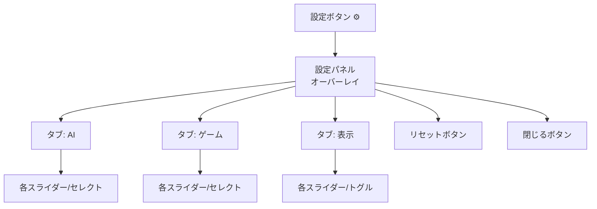

# 設定 UI 仕様（未実装）

| 項目 | 値 |
|------|-----|
| ステータス | 未実装 |
| クレート | web |
| 最終更新 | 2026-02-13 |
| 対応ソース | — |

## 概要

ゲームとAIの各種パラメータをユーザが調整できる設定UIの設計仕様。

## 設定カテゴリ

### 1. AI パラメータ

| 設定項目 | 種類 | 範囲 | デフォルト | 説明 |
|---------|------|------|-----------|------|
| 探索深さ | セレクト | 1, 2, 3 | 2 | AI の先読み手数 |
| AI 操作間隔 | スライダー | 50〜1000ms | 200ms | AI の手を打つ間隔 |
| 連鎖重み | スライダー | 0.0〜100.0 | 50.0 | `W_CHAIN_LENGTH` |
| 高さペナルティ | スライダー | -20.0〜0.0 | -5.0 | `W_HEIGHT_PENALTY` |
| 連結度重み | スライダー | 0.0〜10.0 | 2.0 | `W_CONNECTIVITY` |
| 潜在連鎖重み | スライダー | 0.0〜50.0 | 15.0 | `W_POTENTIAL_CHAIN` |

### 2. ゲーム設定

| 設定項目 | 種類 | 範囲 | デフォルト | 説明 |
|---------|------|------|-----------|------|
| 色数 | セレクト | 3, 4, 5 | 4 | 使用する色の数 |
| 通常重力 | スライダー | 0.01〜0.2 | 0.05 | `GRAVITY_NORMAL` |
| 高速重力 | スライダー | 0.5〜3.0 | 1.0 | `GRAVITY_FAST` |
| 消去数 | セレクト | 3, 4, 5 | 4 | グループ消去の最小連結数 |

### 3. 表示設定

| 設定項目 | 種類 | 範囲 | デフォルト | 説明 |
|---------|------|------|-----------|------|
| セルサイズ | スライダー | 20〜60px | 40px | `CELL_SIZE` |
| ゴースト表示 | トグル | ON/OFF | ON | ゴーストピースの表示切替 |
| テーマ | セレクト | ダーク, ライト | ダーク | 盤面の配色テーマ |
| 目の表示 | トグル | ON/OFF | ON | ぷよの目の描画切替 |

## UI レイアウト



### 設計方針

- 盤面の右側または上部にギアアイコンで設定ボタンを配置
- クリックでオーバーレイパネルを表示
- タブで3カテゴリを切り替え
- 変更は即座に反映（プレビュー）
- 「デフォルトに戻す」ボタンで全設定をリセット

## データ永続化

### ローカルストレージ

```typescript
interface GameConfig {
  ai: {
    searchDepth: number;
    playInterval: number;
    weights: {
      chainLength: number;
      heightPenalty: number;
      connectivity: number;
      potentialChain: number;
    };
  };
  game: {
    numColors: number;
    gravityNormal: number;
    gravityFast: number;
    minGroupSize: number;
  };
  display: {
    cellSize: number;
    showGhost: boolean;
    theme: "dark" | "light";
    showEyes: boolean;
  };
}
```

- キー: `puyo-ai-config`
- 保存タイミング: 設定変更時に自動保存
- 読込タイミング: ゲーム起動時

## WASM 側の対応

AI パラメータとゲーム設定を WASM 側で受け取るために、`WasmGame` に設定メソッドを追加する必要がある:

```rust
#[wasm_bindgen]
impl WasmGame {
    pub fn set_ai_weights(&mut self, chain: f64, height: f64, conn: f64, potential: f64);
    pub fn set_search_depth(&mut self, depth: u32);
    pub fn set_num_colors(&mut self, n: u32);
    pub fn set_min_group_size(&mut self, n: u32);
}
```
