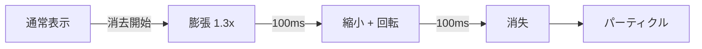
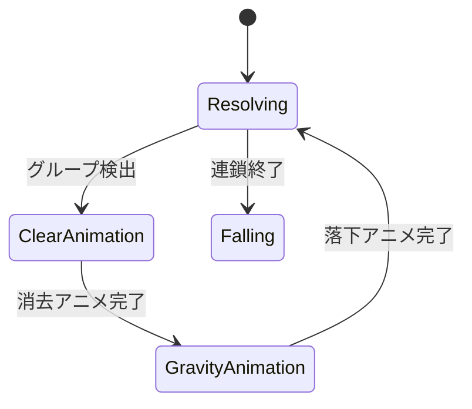

# サウンド・アニメーション仕様（未実装）

| 項目 | 値 |
|------|-----|
| ステータス | 未実装 |
| クレート | web |
| 最終更新 | 2026-02-13 |
| 対応ソース | — |

## 概要

ゲーム体験を向上させる効果音とビジュアルアニメーションの設計仕様。Web Audio API と Canvas アニメーションを使用する。

## 効果音

### Web Audio API の使用

外部音声ファイルを使用せず、Web Audio API の `OscillatorNode` と `GainNode` でプロシージャルに生成する。

### 効果音一覧

| イベント | 音の特性 | 周波数 | 長さ |
|---------|---------|--------|------|
| ぷよ設置 | 短い低音 | 200Hz → 100Hz | 100ms |
| 移動 | クリック音 | 800Hz | 30ms |
| 回転 | 軽い高音 | 600Hz → 400Hz | 50ms |
| 消去 | ポップ音（連鎖数で音程上昇） | 300Hz × chain_num | 200ms |
| 連鎖 | 上昇音階 | 400Hz + chain × 100Hz | 300ms |
| ゲームオーバー | 下降音 | 500Hz → 100Hz | 1000ms |
| リスタート | 短い上昇音 | 300Hz → 600Hz | 200ms |

### 連鎖音の音程設計

連鎖数に応じてピッチが上がり、大連鎖の爽快感を演出:

```
base_freq = 400
freq = base_freq + chain_num * 100
```

| 連鎖 | 1 | 2 | 3 | 4 | 5 | 6 |
|------|---|---|---|---|---|---|
| 周波数 | 500Hz | 600Hz | 700Hz | 800Hz | 900Hz | 1000Hz |

### 実装方針

```typescript
class SoundEngine {
    private ctx: AudioContext;

    playLand(): void;
    playMove(): void;
    playRotate(): void;
    playClear(chainNum: number): void;
    playGameOver(): void;
    playRestart(): void;

    setVolume(volume: number): void;  // 0.0〜1.0
    setMuted(muted: boolean): void;
}
```

- `AudioContext` はユーザ操作後に初期化（ブラウザのオートプレイポリシー対応）
- ボリューム制御とミュート機能

## アニメーション

### 消去エフェクト

ぷよが消える際のアニメーション:

1. **スケールアニメーション**: 1.0 → 1.3 → 0.0（200ms）
2. **回転**: 消去中に45度回転
3. **透明度**: 1.0 → 0.0（フェードアウト）
4. **パーティクル**: 消去位置から小さな円が放射状に飛散（オプション）



### 連鎖数表示

連鎖発生時に盤面中央に連鎖数を大きく表示:

| 属性 | 値 |
|------|-----|
| フォントサイズ | 48px → 60px（ポップアニメーション） |
| 色 | 白（連鎖数3以上で金色） |
| 表示時間 | 500ms |
| アニメーション | スケール 0.5→1.2→1.0 + フェードアウト |
| テキスト | `{n}連鎖!` |

### バウンスアニメーション

ぷよが着地した際のバウンス効果:

1. 着地時にY方向にスケール 1.0 → 0.8 → 1.1 → 1.0（200ms）
2. イージング: ease-out-bounce

### 落下アニメーション

重力で落下するぷよのスムーズな移動:

- 現行は即座に位置更新されるため、補間アニメーションを追加
- 各ぷよの目標位置と現在位置の差分を補間

## Resolving フェーズの可視化

現行では連鎖は瞬時に処理されるが、アニメーション導入により段階的に可視化する。

### フェーズ分割



| フェーズ | 表示 | 所要時間 |
|---------|------|---------|
| グループ検出 | 該当ぷよをハイライト | 100ms |
| 消去アニメーション | スケール+回転+フェード | 300ms |
| 連鎖数表示 | テキストポップアップ | 500ms (並行) |
| 重力アニメーション | ぷよ落下のスムーズ移動 | 200ms |

### 実装上の考慮

- `resolve_chains` を1ステップずつ実行する API が必要
- 現行の `ChainStep` 情報を使ってアニメーション対象を特定
- アニメーション中はプレイヤー操作を無効化

## 設定項目

| 設定 | 種類 | デフォルト |
|------|------|-----------|
| 効果音 ON/OFF | トグル | ON |
| 音量 | スライダー (0-100) | 50 |
| アニメーション ON/OFF | トグル | ON |
| アニメーション速度 | セレクト (遅/普/速) | 普 |
